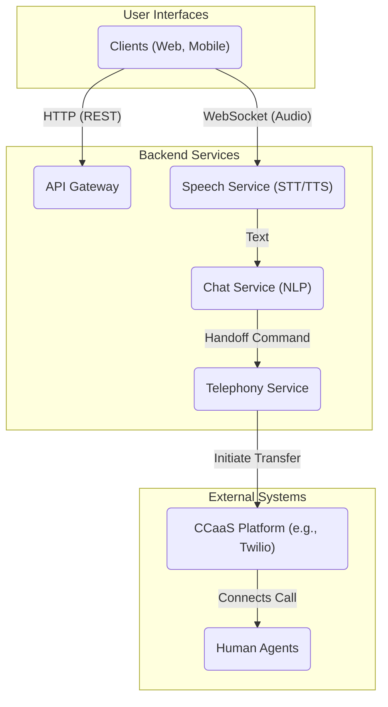

# SpeakSphere - System Architecture

This document provides a detailed overview of the technical architecture for the SpeakSphere application. It is intended for developers, architects, and technical stakeholders.

## 1. Guiding Principles

- **Scalability**: The architecture must support a growing number of users and interactions without significant degradation in performance.
- **Modularity**: Components should be loosely coupled to allow for independent development, deployment, and scaling.
- **Security**: Security is a primary concern. The design incorporates best practices for data protection and access control, adhering to GDPR, CCPA, and HIPAA.
- **Maintainability**: The system should be easy to understand, modify, and extend over time.

## 2. High-Level Architecture

SpeakSphere follows a **distributed, service-oriented architecture**. It consists of a client-side web application, a backend API gateway, and several specialized backend services. This approach allows for a clear separation of concerns and enables polyglot development (e.g., using both Python for AI and Node.js for real-time communication if needed).

## 3. Component Breakdown

### 3.1. Frontend (Client)

- **Technology**: A Single Page Application (SPA) built with a modern JavaScript framework like **React** or **Vue.js**.
- **Responsibilities**:
  - Rendering the user interface for the chatbot and inventory dashboard.
  - Managing client-side state.
  - Communicating with the backend via the API Gateway.
  - Handling user authentication flows (e.g., redirecting to a login page).

### 3.2. Backend Services

The backend is composed of several microservices, each with a distinct responsibility.

#### a. API Gateway

- **Technology**: A lightweight service (e.g., using Node.js with Express or a dedicated gateway like Kong/Tyk).
- **Responsibilities**:
  - Acts as a single entry point for all client requests.
  - Routes requests to the appropriate downstream service.
  - Handles cross-cutting concerns like rate limiting, request logging, and authentication/authorization token validation.

#### b. Chat Service (Customer Inquiries)

- **Technology**: **Python** with Django/Flask.
- **Responsibilities**:
  - Manages the chatbot logic.
  - Integrates with NLP libraries (**spaCy**, **Hugging Face Transformers**) for intent recognition and entity extraction.
  - Supports multilingual input by integrating with translation services.
  - Stores and retrieves conversation history from **MongoDB**.

#### c. Speech Service

- **Technology**: Python, integrating with third-party STT/TTS engines (e.g., Google Speech-to-Text, Amazon Polly).
- **Responsibilities**:
  - Transcribing audio streams from the client into text to be sent to the Chat Service.
  - Converting text responses from the Chat Service into audio streams to be sent back to the client.

#### c. Appointment Service

- **Responsibilities**:
  - Handles all logic related to scheduling, rescheduling, and canceling appointments.
  - Integrates with third-party calendar providers via their APIs (**Google Calendar API**).
  - Manages automated reminders through notification services (**Twilio**, **SendGrid**).

#### d. Inventory Service

- **Technology**: **Python** with Django.
- **Responsibilities**:
  - Provides CRUD (Create, Read, Update, Delete) operations for inventory data.
  - Exposes a secure API for the internal management dashboard.
  - Implements business logic for low-stock alerts and reporting.
  - Interacts with the **PostgreSQL** database.

### 3.3. Databases

- **PostgreSQL**: A relational database used for structured data that requires transactional integrity, such as user accounts and inventory records.
- **MongoDB**: A NoSQL document database chosen for its flexible schema, making it ideal for storing unstructured conversation logs from the chatbot.

## 4. Data Privacy & Security

- **Authentication**: User authentication for the inventory dashboard will be handled by a dedicated Auth service using JWTs (JSON Web Tokens).
- **Authentication**: User authentication for the internal dashboard will be handled by a dedicated service that issues JWTs (JSON Web Tokens). The API Gateway is responsible for validating these tokens on incoming requests.
- **Encryption**: All data will be encrypted in transit using TLS 1.2+ and at rest using database-level encryption (e.g., TDE for PostgreSQL, Encrypted Storage Engine for MongoDB).
- **Compliance**: For HIPAA compliance, all access to Protected Health Information (PHI) will be strictly controlled via Attribute-Based Access Control (ABAC) and logged for auditing. All third-party services handling PHI will require a Business Associate Agreement (BAA).
