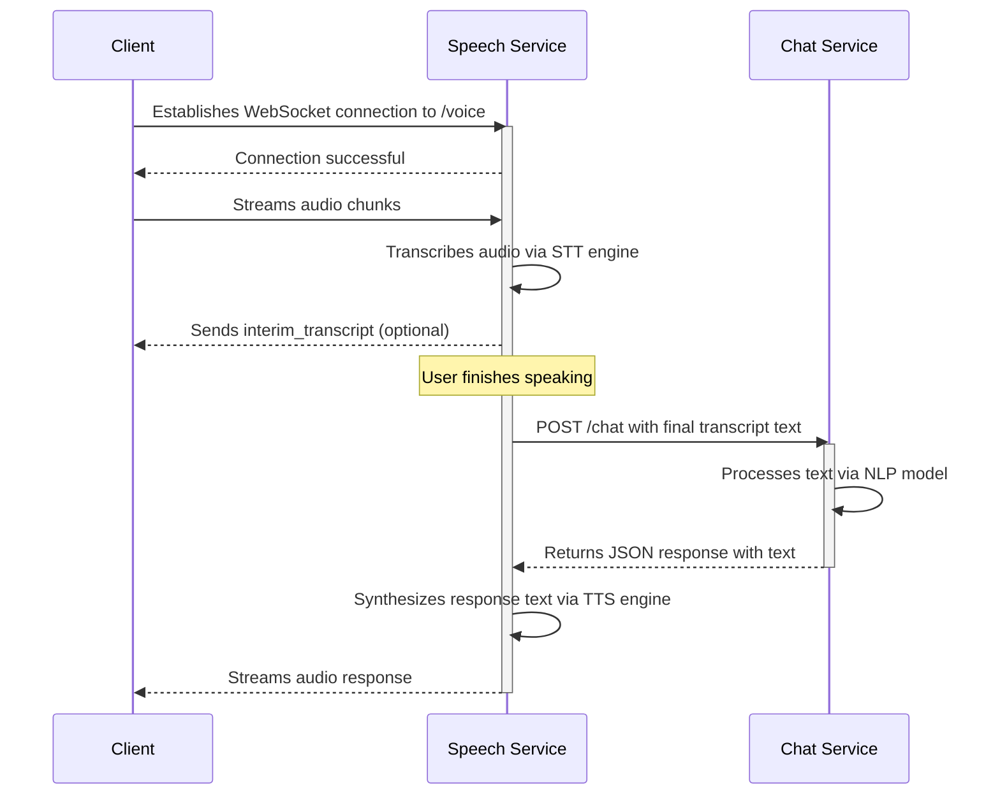

# SpeakSphere - Technical Specification

This document provides low-level technical details about the SpeakSphere architecture and data models. It is an extension of the [System Architecture](./ARCHITECTURE.md) document.

## 1. Data Models

### 1.1. PostgreSQL (Relational Data)

**Database**: `speaksphere_main`

**`inventory_products` Table**:

| Column Name          | Data Type      | Constraints                 | Description                        |
| -------------------- | -------------- | --------------------------- | ---------------------------------- |
| `id`                 | `SERIAL`       | `PRIMARY KEY`               | Unique identifier for the product. |
| `sku`                | `VARCHAR(100)` | `UNIQUE`, `NOT NULL`        | Stock Keeping Unit.                |
| `name`               | `VARCHAR(255)` | `NOT NULL`                  | Display name of the product.       |
| `quantity`           | `INTEGER`      | `NOT NULL`, `DEFAULT 0`     | Current stock level.               |
| `warehouse_location` | `VARCHAR(100)` |                             | Location of the stock.             |
| `created_at`         | `TIMESTAMPTZ`  | `NOT NULL`, `DEFAULT NOW()` | Timestamp of record creation.      |
| `updated_at`         | `TIMESTAMPTZ`  | `NOT NULL`, `DEFAULT NOW()` | Timestamp of last update.          |

**`users` Table**: (For internal dashboard access)

| Column Name     | Data Type      | Constraints          | Description                           |
| --------------- | -------------- | -------------------- | ------------------------------------- |
| `id`            | `SERIAL`       | `PRIMARY KEY`        | Unique identifier for the user.       |
| `email`         | `VARCHAR(255)` | `UNIQUE`, `NOT NULL` | User's email for login.               |
| `password_hash` | `VARCHAR(255)` | `NOT NULL`           | Hashed password.                      |
| `role`          | `VARCHAR(50)`  | `NOT NULL`           | User role (e.g., 'admin', 'manager'). |

**`appointments` Table**:

| Column Name     | Data Type      | Constraints                 | Description                                            |
| --------------- | -------------- | --------------------------- | ------------------------------------------------------ |
| `id`            | `SERIAL`       | `PRIMARY KEY`               | Unique identifier for the appointment.                 |
| `user_id`       | `INTEGER`      | `REFERENCES users(id)`      | Foreign key to the user who booked the appointment.    |
| `start_time`    | `TIMESTAMPTZ`  | `NOT NULL`                  | The scheduled start time of the appointment.           |
| `end_time`      | `TIMESTAMPTZ`  | `NOT NULL`                  | The scheduled end time of the appointment.             |
| `status`        | `VARCHAR(50)`  | `NOT NULL`                  | The current status (e.g., 'scheduled', 'cancelled').   |
| `purpose`       | `TEXT`         |                             | A brief description of the appointment's purpose.      |
| `gcal_event_id` | `VARCHAR(255)` |                             | The event ID from the Google Calendar API integration. |
| `created_at`    | `TIMESTAMPTZ`  | `NOT NULL`, `DEFAULT NOW()` | Timestamp of record creation.                          |
| `updated_at`    | `TIMESTAMPTZ`  | `NOT NULL`, `DEFAULT NOW()` | Timestamp of last update.                              |

**`feedback_ratings` Table**:

| Column Name       | Data Type     | Constraints                 | Description                                                              |
| ----------------- | ------------- | --------------------------- | ------------------------------------------------------------------------ |
| `id`              | `SERIAL`      | `PRIMARY KEY`               | Unique identifier for the feedback entry.                                |
| `conversation_id` | `VARCHAR(50)` | `NOT NULL`                  | The ID of the conversation the feedback is for.                          |
| `message_id`      | `VARCHAR(50)` | `NOT NULL`                  | A unique identifier for the specific bot message that was rated.         |
| `rating`          | `SMALLINT`    | `NOT NULL`                  | The rating given by the user (e.g., 1 for thumbs down, 5 for thumbs up). |
| `comment`         | `TEXT`        |                             | Optional free-text comment from the user.                                |
| `created_at`      | `TIMESTAMPTZ` | `NOT NULL`, `DEFAULT NOW()` | Timestamp of when the feedback was submitted.                            |

### 1.2. MongoDB (Conversational Data)

**Database**: `speaksphere_chat`

**`conversations` Collection**:

Each document represents a single conversation thread.

```json
{
  "_id": "conv_12345abcde", // Conversation ID
  "user_id": "user_session_xyz", // Anonymous user identifier
  "created_at": "2025-11-15T10:00:00Z",
  "messages": [
    { "sender": "user", "text": "Hello", "timestamp": "2025-11-15T10:00:05Z" },
    {
      "sender": "bot",
      "text": "Hi! How can I help you?",
      "timestamp": "2025-11-15T10:00:06Z",
      "intent": "greeting"
    }
  ]
}
```

## 2. Service Communication

- **Internal Communication**: Services will communicate with each other via RESTful APIs. For higher performance needs in the future, an event-driven approach using a message broker like RabbitMQ or Kafka could be adopted.
- **Security**: Service-to-service communication within the cluster will be secured using mutual TLS (mTLS) to ensure that only trusted services can talk to each other.

## 3. Sequence Diagrams

### 3.1. Voice Inquiry Flow

This diagram illustrates the real-time interaction when a user makes a voice inquiry.


